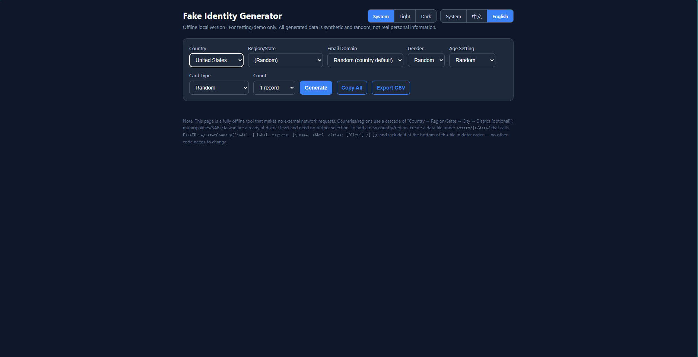
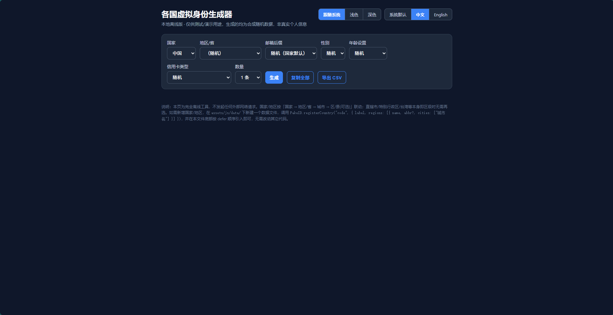

# Fake Identity Generator (Offline)

<p align='center'>
  <a href='README.md'>English</a> &nbsp;·&nbsp; <a href='README_zh.md'>中文</a>
</p>

<p align='center'>
  
  
  
  
</p>

A fully **offline**, **zero-dependency** web application that generates realistic-looking, synthetic virtual identities for 9 countries/regions. All data is randomly generated in the browser — **no network requests are ever made**, no build step is required, and it runs straight from the file system.

> ⚠️ **Disclaimer** — Everything produced by this tool is fictional, randomly synthesized data for **testing, prototyping, and demonstration only**. It is **not** real personal information, and the generated identifiers (ID numbers, SSNs, card numbers, etc.) are **illustrative** and must **never** be used to impersonate a real person or for any fraudulent purpose.

---

## Table of Contents

- [Features](#features)
- [Quick Start](#quick-start)
- [Browser Support](#browser-support)
- [Screenshots](#screenshots)
- [Supported Countries](#supported-countries)
- [Generated Profile Fields](#generated-profile-fields)
- [Realism Engine](#realism-engine)
  - [Birth Date & Age](#birth-date--age)
  - [Body Metrics](#body-metrics)
  - [Occupation by Age](#occupation-by-age)
  - [Company by Age](#company-by-age)
  - [Credit Cards](#credit-cards)
  - [Country-Specific Identifiers](#country-specific-identifiers)
- [Credit Card Networks](#credit-card-networks)
- [Internationalization](#internationalization)
- [Theme (Light / Dark / System)](#theme-light--dark--system)
- [Copy & CSV Export](#copy--csv-export)
- [Project Structure](#project-structure)
- [Architecture](#architecture)
- [Developer Guide: Adding a New Country](#developer-guide-adding-a-new-country)
- [API Reference](#api-reference)
- [Privacy & Security](#privacy--security)
- [Known Limitations](#known-limitations)

---

## Features

- **100% offline & dependency-free.** Pure HTML/CSS/JavaScript (classic scripts loaded with `defer`), so it works directly from `file://` with no server, bundler, or npm install.
- **9 countries/regions** with locale-appropriate names, surnames, given names, regions, cities, streets, companies, occupations, and email domains.
- **Cascading location selectors** — *Country → Region/State → City → District (optional)*. Municipalities, Special Administrative Regions, and Taiwan are already district-level and need no further selection.
- **Bilingual UI (中文 / English)** with automatic detection of the visitor's system language and persistence via `localStorage`.
- **Light / Dark / System theme** driven by a design-token CSS variable system with smooth transitions and no flash-of-wrong-theme (FOUC) on load.
- **Age-aware generation** — birth dates, body metrics (height/weight), occupations, employers, and credit cards are all consistent with the generated age.
- **Valid-structure identifiers** — Chinese ID cards use the real GB 11643-1999 (mod 11-2) checksum; card numbers pass the **Luhn** algorithm; SSN/NINO/My Number/Steuer-ID/NIR/Codice Fiscale/DNI follow their respective format conventions (all demo/illustrative).
- **Flexible controls** — gender, age mode (random / exact / range), email domain (random per country / popular webmail / custom), card network, and batch count (1/3/5/10).
- **Copy All** (Clipboard API with an `execCommand` fallback) and **Export CSV** (UTF-8 BOM, RFC-style quoting/escaping) for quick reuse in tests and demos.
- **Extended profiles** — education, major, school (with country), company size, income level, skills, interests, personality traits, pet, favorite food, travel style, physical appearance (hair/eye/skin), blood type, body type, **security question & answer**, **online signature**, timezone, and website.
- **Country-specific security QA & signatures** — each of the 9 supported countries has its own pool of 15 culturally-appropriate question/answer pairs and 15 culturally-appropriate online signatures in `PROFILE.securityQAByCountry` and `PROFILE.signaturesByCountry` (see `assets/js/data/profile.js`). For instance, a **Japanese** identity receives questions like _"母の旧姓は何ですか？"_ → _"田中"_, while a **US** identity receives _"What is your mother's maiden name?"_ → _"Smith"_. Every pair is translated into both Chinese and English for UI display; countries whose native language is neither Chinese nor English (Japan, Germany, France, Italy, Spain) also retain a **native-language version** (e.g., Japanese, German, French, Italian, Spanish) as a fallback. The pre-existing generic `securityQA` pool (8 pairs) is kept as a last-resort fallback for any future country without dedicated QA data.
- **Email domain validation** — custom email domains are validated against a strict allowlist at the engine layer (`util.isValidEmailDomain`), rejecting injection attempts and malformed domains; invalid input falls back to the country's default domain pool with a warning.
- **Robust CSV export** — column headers are the **union of all keys** across the generated batch, so age-dependent fields (`company`, `cardType`, etc.) never cause column misalignment. Formula-injection prefixes (=, +, -, @) are neutralized per OWASP CSV Injection prevention.

---

## Quick Start

No installation or build is required.

1. Download / clone this repository.
2. Open `index.html` in any modern browser (double-click works — `file://` is fully supported).
3. Pick a country, adjust the controls, and click **Generate**.

Optionally serve it with any static file server:

```bash
# Python
python3 -m http.server 8080
# then visit http://localhost:8080

# or Node
npx serve .
```

---

## Browser Support

| Feature | Minimum |
| --- | --- |
| Core generation | Any browser with ES5 + `Array`/`String` support |
| Clipboard copy | `navigator.clipboard` (with `document.execCommand('copy')` fallback) |
| Dark mode auto-detect | `window.matchMedia('(prefers-color-scheme: dark)')` |
| Persistence | `localStorage` (gracefully degrades if blocked) |

Tested conceptually on evergreen desktop and mobile browsers.

---

## Screenshots

| Feature | English | 中文 |
| --- | --- | --- |
| **Interface language** |  |  |
| **Light mode** |  |  |
| **Dark mode** |  |  |
| **Country selection** |  |  |
| **Generation example** |  |  |

---

## Supported Countries

| Code | Country | Locale | Identifier field | Notes |
| --- | --- | --- | --- | --- |
| `china` | China (中国) | `zh` | 身份证号 (ID card) | 6-digit region code + checksum; district-level cities for municipalities/SARs/Taiwan |
| `us` | United States | `en` | SSN (demo) | Format `AAA-BB-CCCC`; excludes area `666` and `900+` |
| `japan` | Japan (日本) | `ja` | My Number (demo) | 12 digits; Japanese given/surnames |
| `uk` | United Kingdom | `en` | NINO (demo) | e.g. `AB123456C` |
| `germany` | Germany (德国) | `de` | Steuer-ID (demo) | 11 digits, grouped `XX XXX XXX XXX` |
| `france` | France | `fr` | NIR (demo) | Encodes gender + birth date |
| `italy` | Italy (意大利) | `it` | Codice Fiscale (demo) | |
| `spain` | Spain (西班牙) | `es` | DNI (demo) | |
| `canada` | Canada | `en` | SIN (demo) | Format `XXX-XXX-XXX`; postal code `A1B 2C3` |

> Note: every identifier above is **synthetic and for demonstration only** — it follows the public format/checksum conventions but is **not** a valid, issued number.

---

## Generated Profile Fields

There are two profile 'shapes':

**Western profile** (built by `util.buildWestern`, used by `us`, `uk`, `japan`, `germany`, `france`, `italy`, `spain`, `canada`):

| Field key | Label (EN) | Label (中文) | Notes |
| --- | --- | --- | --- |
| `lastName` | Last Name | 姓 | |
| `firstName` | First Name | 名 | |
| `gender` | Gender | 性别 | `male` / `female` |
| `birthDate` | Date of Birth | 出生日期 | `YYYY-MM-DD` |
| `age` | Age | 年龄 | derived from birth date |
| `height` | Height | 身高 | e.g. `172 cm` |
| `weight` | Weight | 体重 | e.g. `68 kg` |
| `phone` | Phone | 手机号 | locale prefix + random |
| `email` | Email | 邮箱 | from email pool / custom domain |
| `username` | Username | 用户名 | ASCII handle |
| `password` | Password | 密码 | 10-char random |
| `id` | ID / SSN / NINO / … | 证件号 / SSN(示意) / … | country-specific (label varies) |
| `address` | Address | 地址 | street + city (+ region) |
| `zip` | Postal Code | 邮编 | country-specific format |
| `company` | Company | 公司 | only for working-age adults |
| `occupation` | Occupation | 职业 | age-category or job from pool |
| `cardType` | Card Type | 信用卡类型 | only for adults ≥ 18 |
| `cardNumber` | Card Number | 卡号 | Luhn-valid |
| `expiry` | Expiry | 有效期 | `MM/YY` |
| `cvv` | CVV | 安全码 | 3–4 digits |

**China profile** (`china` module, uses a combined name):

| Field key | Label (EN) | Label (中文) |
| --- | --- | --- |
| `fullName` | Full Name | 姓名 |
| `gender` | Gender | 性别 |
| `birthDate` | Date of Birth | 出生日期 |
| `age` | Age | 年龄 |
| `height` | Height | 身高 |
| `weight` | Weight | 体重 |
| `idCard` | ID Number | 身份证号 |
| `phone` | Phone | 手机号 |
| `email` | Email | 邮箱 |
| `username` | Username | 用户名 |
| `password` | Password | 密码 |
| `address` | Address | 地址 |
| `company` | Company | 公司 (working-age only) |
| `occupation` | Occupation | 职业 |
| `cardType` / `cardNumber` / `expiry` / `cvv` | Card fields | 信用卡相关 (adults ≥ 18 only) |

Fields are stored internally as `[key, value]` pairs and localized at render time according to the active UI language, so the same data can be displayed in either 中文 or English.

In addition to the core fields above, an **extended profile** is appended by `util.profileFields` — covering education, major, school (with the school's country), company size, income level, skills, interests, personality traits, pet, favorite food, travel style, physical appearance (hair/eye/skin), blood type, body type, **security question & answer**, **online signature**, timezone, and website.

> **Multi-timezone support**: countries spanning multiple IANA timezones (US, Canada, France, Spain) randomly select a geographically-appropriate zone on each generation (e.g., US → `America/New_York`, `America/Chicago`, `America/Denver`, `America/Los_Angeles`, `America/Anchorage`, `Pacific/Honolulu`; Canada → 29 zones including `America/St_Johns`, `America/Toronto`, `America/Vancouver`; France → Metropolitan + 13 overseas territories; Spain → `Europe/Madrid` + `Atlantic/Canary`). Single-zone countries (China, Japan, UK, Germany, Italy) return their one canonical zone (`Asia/Shanghai`, `Asia/Tokyo`, `Europe/London`, `Europe/Berlin`, `Europe/Rome`).

> **Country-specific security QA & online signatures** — each of the 9 supported countries has its own pool of 15 culturally-appropriate question/answer pairs and 15 culturally-appropriate online signatures in `PROFILE.securityQAByCountry` and `PROFILE.signaturesByCountry` (see `assets/js/data/profile.js`). For instance, a **Japanese** identity receives questions like _"母の旧姓は何ですか？"_ → _"田中"_, while a **US** identity receives _"What is your mother's maiden name?"_ → _"Smith"_. Every pair is translated into both Chinese and English for UI display; countries whose native language is neither Chinese nor English (Japan, Germany, France, Italy, Spain) also retain a **native-language version** (e.g., Japanese, German, French, Italian, Spanish) as a fallback. The pre-existing generic `securityQA` pool (8 pairs) is kept as a last-resort fallback for any future country without dedicated QA data.

---

## Realism Engine

All randomness is funneled through `util` helpers so that generated records stay internally consistent.

### Birth Date & Age

- `ageMode = random` → birth date uniformly sampled between **1965** and **2004**.
- `ageMode = exact` → a birth date is chosen so that `util.ageFrom(date)` **exactly equals** the requested age (birthday is guaranteed to have already occurred this year).
- `ageMode = range` → an age is drawn from the inclusive range (min/max auto-swapped if reversed), then the exact birth date is derived.
- `util.ageFrom(date)` computes the current age with correct month/day handling.

### Body Metrics

`util.bodyMetrics(gender, age)` returns a `[heightCm, weightKg]` pair scaled by a growth factor:

- infants/toddlers have proportionally small heights (no 'baby with an adult body');
- ages 3–17 interpolate toward adult height;
- adults use a gender-based reference height with variation;
- seniors (≥ 70) lose a small amount of height;
- weight is estimated from an age-appropriate BMI × height².

### Occupation by Age

`util.occupationForAge(age, cfg)` enforces age-appropriateness:

| Age | Category | Behavior |
| --- | --- | --- |
| < 6 | child (学龄前儿童 / Child) | no occupation |
| 6 – 17 | student (学生 / Student) | no occupation |
| 18 – 64 | working adult | random job drawn from the locale's occupation pool |
| ≥ 65 | retired (退休 / Retired) | no occupation |

The category **code** (`child` / `student` / `retired`) is stored and localized at render time, while adult job names come from the country's native-language occupation pool and are **not** translated.

### Company by Age

`util.companyForAge(age, cfg)` returns an employer **only** for working-age adults (18–64). Minors, preschoolers, students, and retirees get **no** `company` field — avoiding 'a 5-year-old employed at a corporation' mismatches.

### Credit Cards

`util.creditCardForAge(age, opts)` emits the four card fields **only** when `age ≥ 18`. Minors receive none. When generated:

- the card network is chosen from `opts.cardType` or picked at random;
- the number is built from a valid IIN/BIN prefix and padded, then a **Luhn** check digit is appended (`util.luhnCheckDigit`);
- expiry is `MM/YY` between 2025 and 2034; CVV length depends on the network (3 digits, 4 for American Express);
- display formatting follows network conventions (AmEx → `4-6-5`, others → `4-4-4-4`).

### Country-Specific Identifiers

- **China `idCard`** — `util.makeChinaID(region6, date)` formats `regionCode(6) + birthDate(8) + sequence(3) + checksum(1)` and computes the check digit with `util.chinaIDChecksum` using the GB 11643-1999 (mod 11-2) weights `[7,9,10,5,8,4,2,1,6,3,7,9,10,5,8,4,2]` and remainder map `['1','0','X','9','8','7','6','5','4','3','2']`.
- **US `ssn`** — `AAA-BB-CCCC`; area avoids `000`, `666`, and `900–999`.
- **UK `nino`** — two letters + 6 digits + one suffix letter (`A–D`).
- **Japan `myNumber`** — 12 digits.
- **Germany `taxId` (Steuer-ID)** — 11 digits, displayed in `XX XXX XXX XXX` groups.
- **France `nir`** — encodes gender and birth date per the French NIR convention.
- **Italy `cf`** — Codice Fiscale style.
- **Spain `dni`** — DNI style.
- **Canada `sin`** — `XXX-XXX-XXX`; postal code follows `A1B 2C3`.

---

## Credit Card Networks

The `util.cardTypes` registry ships with **~60** global and regional card networks (label, IIN/BIN prefixes, length, CVV length). A selection:

Visa, Visa Electron, Mastercard, American Express, Discover, JCB, UnionPay (银联), Diners Club, Carte Blanche, Maestro, RuPay, Mir (Мир), Troy, Elo, Dankort, Interac, Verve, UATP, Laser, Switch, Solo, Bancontact, EnRoute, Voyager, InstaPayment, PostePay, SberCard, NAPS, KCP, MEPS, BC Card, PolCard, Girocard, Carte Bancaire, LankaPay, NepalPay, BCA, and more.

Brand display names are localized through `i18n.card(key)`.

---

## Internationalization

`assets/js/i18n.js` is the single source of truth for UI text and field labels.

- **Languages:** `zh` (中文) and `en` (English). System language is auto-detected from `navigator.languages` (falls back to 中文).
- **Persistence:** the chosen preference (`system` / `zh` / `en`) is saved to `localStorage['fakeid.lang']`.
- **DOM translation:** `i18n.apply(root)` rewrites any element carrying one of:
  - `data-i18n` → `textContent`
  - `data-i18n-ph` → `placeholder`
  - `data-i18n-title` → `title`
  - `data-i18n-html` → `innerHTML` (used for the disclaimer)
- **Field & value localization:** `i18n.field(key)`, `i18n.gender(code)`, `i18n.occLabel(code)`, `i18n.card(key)`, and `i18n.countryLabel(code)` keep generated output consistent with the active language.
- **Observer:** `i18n.onChange(cb)` lets the UI re-render on language switch without reload.

---

## Theme (Light / Dark / System)

`assets/js/theme.js` manages a `system` / `light` / `dark` preference persisted in `localStorage['fakeid.theme']`.

- `system` → no `data-theme` attribute is set; CSS `@media (prefers-color-scheme: dark)` decides automatically (and tracks live OS changes).
- `light` / `dark` → an explicit `data-theme` attribute overrides the OS preference.
- A tiny inline script in `<head>` applies the saved explicit theme **before first paint** to avoid a flash of the wrong theme (FOUC).
- Design tokens (colors, borders, shadows) are centralized as CSS variables in `assets/css/styles.css`, giving a consistent slate + blue/emerald palette across both modes with smooth color transitions.

---

## Copy & CSV Export

- **Copy All** — builds a plain-text block of all generated records (localized to the active language) and writes it via `navigator.clipboard.writeText`, falling back to a hidden `<textarea>` + `document.execCommand('copy')` on unsupported browsers.
- **Export CSV** — emits a UTF-8 file prefixed with a BOM (``) so Excel correctly recognizes Chinese; RFC-style quoting/escaping for fields containing commas, quotes, or newlines. Headers use localized field labels. **Formula-injection prefixes** (=, +, -, @, tab, newline, /, |) are neutralized by prepending a single quote.

---

## Project Structure

```text
.
├── index.html                 # Application shell; scripts loaded with defer in dependency order
└── assets
    ├── css
    │   └── styles.css          # Design-token theme (light/dark/system)
    └── js
        ├── i18n.js             # UI strings, field labels, card/country/occupation names
        ├── util.js             # Registry + generation utilities (zero-dep)
        ├── generator.js        # FakeID.generate / FakeID.listCountries
        ├── theme.js            # Light/dark/system preference + observer
        ├── app.js              # UI orchestration (cascading selects, render, copy, export)
        └── data
            ├── occupations.js  # Per-language occupation pools (util.occupationPool)
            ├── maildomains.js  # Per-language email domain pools (util.emailPool)
            ├── profile.js      # Extended profile pools (schools, skills, security QA, signatures, timezones, etc.)
            ├── china.js        # registerCountry('china', …) — custom make()
            ├── us.js           # registerCountry('us', …)   — buildWestern
            ├── japan.js        # registerCountry('japan', …)
            ├── uk.js           # registerCountry('uk', …)
            ├── germany.js      # registerCountry('germany', …)
            ├── france.js       # registerCountry('france', …)
            ├── italy.js        # registerCountry('italy', …)
            ├── spain.js        # registerCountry('spain', …)
            └── canada.js       # registerCountry('canada', …)
```

---

## Architecture

The app is built around a single global namespace **`window.FakeID`**, composed of several small, independent modules loaded with `defer` (execution order = document order, so `file://` works without a module system or CORS).

| Module | Responsibility |
| --- | --- |
| `i18n.js` | Bilingual dictionary: UI strings, field labels, card brand names, country names, age-category occupation labels; provides `apply()`, `t()`, `field()`, `card()`, `gender()`, `countryLabel()`, `occLabel()`, `setLang()`, `onChange()`. |
| `util.js` | Core engine: random helpers, date/age logic, body metrics, age-aware occupation/company, password/handle generation, China ID checksum, email/pool resolvers, shared `buildWestern()` profile builder, `cardTypes` registry + Luhn logic, and **country registry** (`registerCountry`). |
| `generator.js` | Public entry points `FakeID.generate(code, opts)` and `FakeID.listCountries()`. |
| `theme.js` | Theme preference + observer; writes `data-theme` on `<html>`. |
| `app.js` | Wires up DOM: country→region→city→district cascading, control bindings, render, copy/export, language/theme switching. |
| `data/*.js` | Each file makes one `registerCountry(code, cfg)` call. `occupations.js` and `maildomains.js` provide shared, per-language pools. `profile.js` provides extended profile pools (schools, skills, security QA, signatures, timezones) and is registered as `FakeID.profile`. |

**Extensibility model:** a country/region is just a data file calling `FakeID.registerCountry('code', { label, locale, regions, make })`. The UI discovers it automatically via `FakeID.listCountries()` — apart from adding the `<script>` tag, no changes to `app.js` or `index.html` control logic are needed.

---

## Developer Guide: Adding a New Country

1. **Create a data module** under `assets/js/data/`, e.g. `assets/js/data/example.js`:

```js
(function (global) {
  'use strict';
  var FakeID = global.FakeID, util = FakeID.util;

  var surnames    = ['Surname1', 'Surname2'];
  var givenMale   = ['Male1', 'Male2'];
  var givenFemale = ['Female1', 'Female2'];
  // Region → City → (optional) District
  var regions = [
    { name: 'Region A', abbr: 'RA', cities: ['City X', 'City Y'] },
    { name: 'Region B', cities: [{ name: 'City Z', districts: ['District 1'] }] }
  ];
  var streets   = ['Main St', 'Oak Ave'];
  var companies = ['Example Corp', 'Example Group'];
  var jobs      = util.occupationPool('zh'); // or 'en','de','fr','it','es','ja'

  FakeID.registerCountry('ex', {
    label: 'Example Country',   // shown in dropdown (localized via i18n.COUNTRY)
    locale: 'zh',
    regions: regions,
    make: function (opts) {
      var cfg = {
        regions: regions,
        surnames: surnames, givenMale: givenMale, givenFemale: givenFemale,
        domains: util.emailPool('zh'),
        phonePrefix: ['138'], phoneLen: 8,
        idLabel: 'id',
        idFn: function () { return 'ID-' + util.pad(util.randInt(0, 999999), 6); },
        addressFn: function (u, ctx) {
          var city = ctx.city ? (typeof ctx.city === 'string' ? ctx.city : ctx.city.name) : '';
          return u.randInt(1, 199) + ' ' + u.pick(streets) + ', ' + city;
        },
        zipFn: function (u) { return util.pad(util.randInt(0, 99999), 5); },
        companies: companies, jobs: jobs, locale: 'zh'
      };
      return util.buildWestern(cfg, opts); // shared Western profile builder
    }
  });
})(window);
```

2. **Register UI strings** (country name + any new occupation text) in `assets/js/i18n.js` — add the code to both `zh` and `en` `COUNTRY` maps so dropdown labels localize correctly.

3. **Load the script**: in `index.html`, add it in the `defer` sequence after `util.js` / `occupations.js` / `maildomains.js` / `profile.js` and before `generator.js`:

```html
<script defer src='assets/js/data/example.js'></script>
```

Done — the new country appears in the dropdown with cascading selectors, i18n, theme, copy, and CSV export all working automatically, no other code changes required.

---

## API Reference

### `window.FakeID`

| Member | Signature | Description |
| --- | --- | --- |
| `generate` | `generate(code, opts) → Array<[key, value]>` | Generate one identity. See `opts` below. |
| `listCountries` | `listCountries() → Array<{code,label,hasStates,states,hasRegions,regions}>` | List registered countries. |
| `countries` | `Object<code, cfg>` | Raw registry. |
| `registerCountry` | `registerCountry(code, cfg)` | Register a country/region. |
| `util` | `Object` | Core engine (see below). |
| `i18n` | `Object` | i18n API (see below). |
| `theme` | `Object` | Theme API (see below). |
| `profile` | `Object` | Extended profile pools & timezones (`pools`, `timezones`). |

### Generation Options (`opts`)

| Key | Values | Effect |
| --- | --- | --- |
| `gender` | `'random'` | `'male'` | `'female'` | Gender choice. |
| `cardType` | `'random'` | card network key | Specific network or random. |
| `region` | Region name | Restrict to a region/province. |
| `city` | City name | Restrict to a city. |
| `district` | District name | Restrict to a district (if applicable). |
| `ageMode` | `'random'` | `'exact'` | `'range'` | Age strategy. |
| `ageExact` | Number | Used when `ageMode === 'exact'`. |
| `ageMin` / `ageMax` | Number | Used when `ageMode === 'range'`. |
| `emailDomain` | String | Override country default email domain (leading `@` stripped). |
| `countryCode` | String | Used by `profileFields` for country-specific pools (auto-set by generator). |

### `FakeID.util` (selected)

`randInt(min,max)`, `pick(arr)`, `chance(p)`, `pad(n,len)`, `randomDate(y1,y2)`, `formatDate(d,sep)`, `ageFrom(d)`, `deaccent(s)`, `birthDate(opts)`, `birthDateForAge(age)`, `bodyMetrics(gender,age)`, `occupationForAge(age,cfg)`, `companyForAge(age,cfg)`, `password(len)`, `randomHandle(len)`, `chinaIDChecksum(body17)`, `makeChinaID(region6,date)`, `emailDomain(opts,defaults)`, `isValidEmailDomain(domain)`, `buildWestern(cfg,opts)`, `emailPool(locale)`, `occupationPool(locale)`, `cardTypes`, `cardTypeKeys()`, `luhnCheckDigit(body)`, `creditCard(opts)`, `formatCardNumber(num,key)`, `creditCardFields(opts)`, `creditCardForAge(age,opts)`, `registerCountry(code,cfg)`, `profileFields(opts,ctx)`, `timezoneFor(code)`, `websiteFor(ctx)`, `validateParallelArrays(zhPool, enPool, keys)`.

### `FakeID.i18n`

`SUPPORTED`, `lang()`, `pref()`, `detectSystemLang()`, `t(key)`, `field(key)`, `countryLabel(code)`, `occLabel(code)`, `card(key)`, `gender(code)`, `setLang(lang, persist?)`, `onChange(cb)`, `apply(root)`.

### `FakeID.theme`

`SUPPORTED` (`['system','light','dark']`), `pref()`, `systemPrefersDark()`, `isDark()`, `set(theme)`, `onChange(cb)`.

### `FakeID.profile`

`pools` — the extended profile data object (`zh`/`en` plus `securityQAByCountry`, `signaturesByCountry`). `timezones` — country→IANA timezone map.

---

## Privacy & Security

- **No network access.** Zero external requests (no CDN, no analytics, no external fonts, no telemetry). Open the browser Network tab — nothing leaves the browser.
- **No data retention.** Records exist only in the DOM until you copy or export; nothing is written to a server or shared.
- **Purely synthetic.** All values are randomly generated; identifiers follow public format specs but are **not** valid issued numbers and must not be used to represent real individuals.
- **CSV injection defense** — formula prefixes (=, +, -, @, tab, newline, /, |) are neutralized.
- **Email domain allowlist** — `util.isValidEmailDomain` enforces a strict domain format (ASCII, valid label structure, ≤253 chars) at the engine layer, shared by UI and any programmatic caller.

---

## Known Limitations

- Name and occupation pools are **curated samples**, not exhaustive census data; for illustration only, not statistically representative.
- The Chinese (`zh`) occupation pool still contains a few unlocalized placeholder entries pending cleanup.
- All identifiers are **demo/illustrative** — although they conform to public formats and checksums, they are unvalidated and non-issuable.
- No automated tests or CI pipeline in this repository yet.

---

## Star History

<a href="https://www.star-history.com/?repos=ljy969%2FVirtual-Identity-Generator&type=date&legend=top-left">
 <picture>
   <source media="(prefers-color-scheme: dark)" srcset="https://api.star-history.com/chart?repos=ljy969/Virtual-Identity-Generator&type=date&theme=dark&legend=top-left&sealed_token=3qIFWIq4W_I-K9HkzvFZigUDxouDgAhC2iSEf1vV-m65Kx6TzulfXGXOfTWEu6m9qBYhJEayzj8JC7oMewXrlQwMavS4PPY02dzAwQDHI8NJfm1zOQxWSA" />
   <source media="(prefers-color-scheme: light)" srcset="https://api.star-history.com/chart?repos=ljy969/Virtual-Identity-Generator&type=date&legend=top-left&sealed_token=3qIFWIq4W_I-K9HkzvFZigUDxouDgAhC2iSEf1vV-m65Kx6TzulfXGXOfTWEu6m9qBYhJEayzj8JC7oMewXrlQwMavS4PPY02dzAwQDHI8NJfm1zOQxWSA" />
   
 </picture>
</a>
